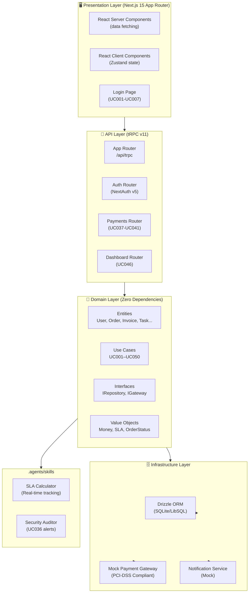
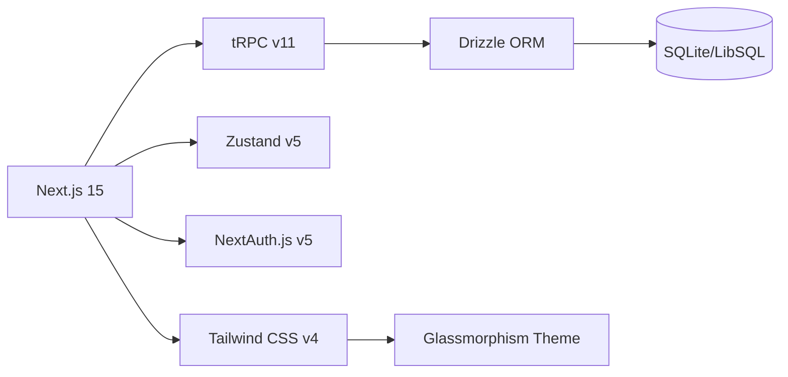
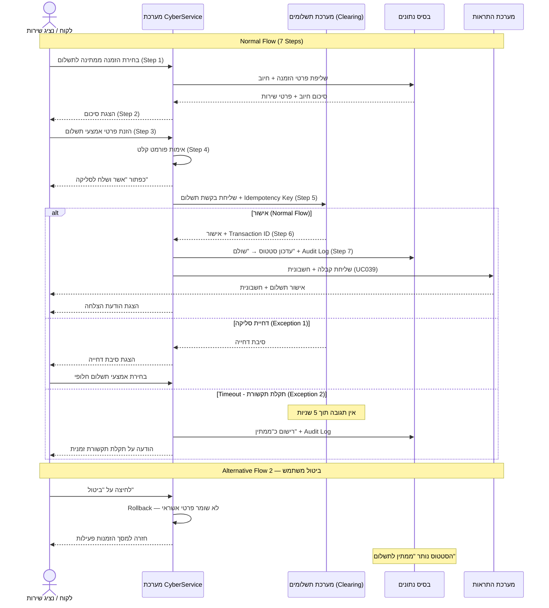
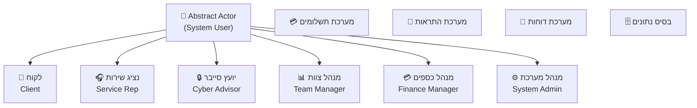

# 🛡️ CyberService ESM — Gold Standard

> **מערכת לניהול שירותי אבטחת מידע** | Enterprise Service Management Platform for Cybersecurity

[**🚀 View Live Demo**](https://cyberservice-system-live.vercel.app/)


[](https://nextjs.org/)
[](https://trpc.io/)
[](https://www.typescriptlang.org/)
[](https://orm.drizzle.team/)
[](https://opensource.org/licenses/MIT)

---

## 📋 תוכן עניינים

- [סקירה כללית](#-סקירה-כללית)
- [ארכיטקטורה](#-ארכיטקטורה)
- [50 Use Cases](#-50-use-cases)
- [UC037 — תרחיש תשלום](#-uc037--תרחיש-תשלום-מלא)
- [התקנה והפעלה](#-התקנה-והפעלה)
- [מבנה הפרויקט](#-מבנה-הפרויקט)
- [שחקנים](#-שחקנים)
- [Agents & Skills](#-agents--skills)
- [אבטחה](#-אבטחה)

---

## 🌐 סקירה כללית

**CyberService ESM** היא פלטפורמה לניהול מחזור החיים המלא של שירותי אבטחת מידע ללקוחות עסקיים — מרישום ראשוני, דרך ביצוע שירות על ידי יועץ סייבר, ועד הפקת דוח סיכונים ותשלום מאובטח.

### ✨ תכונות עיקריות

| תכונה | פרטים |
|---|---|
| **50 Use Cases** | UC001–UC050 מיושמים ב-Clean Architecture |
| **Dark Glassmorphism UI** | Bento Grid + מיקרו-אנימציות + RTL |
| **UC037 Payment** | תהליך תשלום מלא עם כל הזרמים החלופיים |
| **SLA Tracking** | מעקב בזמן אמת עם ring charts |
| **Security Audit Agent** | בדיקות PCI-DSS, ISO27001, GDPR, NIST |
| **6 תפקידים** | RBAC מלא לכל שחקן בשיטה |
| **Server Components** | RSC לשליפת נתונים מהשרת |

---

## 🏗️ ארכיטקטורה

### Clean Architecture Layers



### Technology Stack



---

## 📊 50 Use Cases

| # | קטגוריה | Use Cases |
|---|---|---|
| UC001–UC010 | **ניהול משתמשים** | רישום, התחברות, עדכון, הרשאות, השבתה |
| UC011–UC020 | **ניהול שירותים** | קטלוג, הזמנה, ביטול, מנוי, יומן |
| UC021–UC032 | **ביצוע שירות** | מעקב, הקצאה, עדכון, תיעוד שעות, ממצאים |
| UC033–UC036 | **דוחות סיכונים** | טיוטה, אישור, פרסום, התראת ממצא קריטי |
| UC037–UC041 | **תשלומים** | תשלום, מנויים, קבלה, החזר, היסטוריה |
| UC042–UC045 | **שירות לקוח** | פנייה, טיפול, משוב, דירוג |
| UC046–UC050 | **ניהול מערכת** | לוח בקרה, דוחות, DB ops |

---

## 💳 UC037 — תרחיש תשלום מלא

### Sequence Diagram



### Business Rules (UC037)

| כלל | פרטים |
|---|---|
| **BR1** | רק בעל ההזמנה או נציג שירות רשאים לבצע תשלום |
| **BR2** | כל ניסיון תשלום מתועד ב-Audit Log |
| **Security** | PCI-DSS · TLS 1.3 · לא שומרים מספר כרטיס מלא |
| **Performance** | SLA: עד 5 שניות לאישור סליקה קצה-לקצה |
| **Reliability** | סנכרון חוזר במקרה ניתוק לפני קבלת אישור |

---

## 🚀 התקנה והפעלה

### דרישות מקדימות

- Node.js ≥ 20
- npm ≥ 10

### שלבי התקנה

```bash
# שלב 1: כניסה לתיקיית הפרויקט
cd cyberservice

# שלב 2: התקנת תלויות
npm install

# שלב 3: הגדרת משתני סביבה
cp .env.example .env.local

# שלב 4: הפעלת שרת פיתוח
npm run dev
```

### כניסה לדמו

פתח `http://localhost:3000` — תועבר אוטומטית למסך הכניסה.

| תפקיד | אימייל | סיסמה |
|---|---|---|
| לקוח | `client@demo.com` | `demo123` |
| נציג שירות | `rep@demo.com` | `demo123` |
| יועץ סייבר | `advisor@demo.com` | `demo123` |
| מנהל צוות | `manager@demo.com` | `demo123` |
| מנהל כספים | `finance@demo.com` | `demo123` |
| מנהל מערכת | `admin@demo.com` | `demo123` |

---

## 📁 מבנה הפרויקט

```
cyberservice/
├── src/
│   ├── core/                          # 🧠 Domain Layer
│   │   ├── entities/index.ts          # User, Order, Invoice, Task...
│   │   ├── value-objects/index.ts     # Money, SLA, OrderStatus, UserRole
│   │   └── usecases/
│   │       └── process-payment.uc037.ts  # UC037 - Complete implementation
│   ├── infrastructure/
│   │   ├── db/
│   │   │   ├── schema.ts              # Drizzle ORM schema (10 tables)
│   │   │   └── client.ts             # SQLite client + seed data
│   │   └── services/
│   │       └── mock-payment-gateway.ts  # Payment simulator (all UC037 flows)
│   ├── server/api/
│   │   ├── trpc.ts                    # tRPC v11 init + role guards
│   │   ├── root.ts                    # App router
│   │   └── routers/
│   │       ├── payments.ts            # UC037-UC041
│   │       └── dashboard.ts          # UC046
│   ├── lib/
│   │   ├── auth.ts                   # NextAuth v5 (6 demo users)
│   │   └── trpc.ts                   # tRPC React client
│   ├── components/
│   │   └── layout/
│   │       └── DashboardSidebar.tsx  # Navigation with UC references
│   └── app/
│       ├── layout.tsx                # Root layout (RTL + Glassmorphism)
│       ├── page.tsx                  # Redirect to dashboard/login
│       ├── login/page.tsx            # Login with role quick-switch
│       ├── dashboard/
│       │   ├── page.tsx             # RSC data fetching
│       │   ├── DashboardClient.tsx  # Bento Grid UI
│       │   └── payments/page.tsx   # UC037 multi-step wizard
│       └── api/
│           ├── trpc/[trpc]/route.ts # tRPC API handler
│           └── auth/[...nextauth]/  # NextAuth handler
├── .agents/
│   └── skills/
│       ├── sla-calculator.ts        # SLA compliance engine
│       └── security-auditor.ts     # PCI-DSS/ISO27001/GDPR checks
└── README.md
```

---

## 👥 שחקנים



---

## 🤖 Agents & Skills

### SLA Calculator (`.agents/skills/sla-calculator.ts`)

```typescript
const slaResult = slaCalculator.calculate({
  orderId: "ord-001",
  slaLevel: "CRITICAL",   // 4h response SLA
  createdAt: new Date("2026-05-01T10:00:00Z"),
  status: "IN_PROGRESS",
});
// → { compliancePercent: 45, status: "AT_RISK", remainingHours: 1.8 }
```

### Security Auditor (`.agents/skills/security-auditor.ts`)

```typescript
const report = securityAuditor.runAudit();
// → { score: 82, passed: 12, failed: 4, overallStatus: "AT_RISK" }

const alerts = securityAuditor.generateCriticalAlerts(report);
// → ["🚨 CRITICAL: Admin interface exposed to internet..."]
```

---

## 🔐 אבטחה

| דרישה | יישום |
|---|---|
| PCI-DSS | רק 4 ספרות אחרונות של כרטיס נשמרות |
| TLS 1.3 | מוגדר ב-Next.js deployment |
| RBAC | `roleGuard()` על כל endpoint רגיש |
| Audit Log | כל ניסיון תשלום מתועד (UC037 BR2) |
| Idempotency | מניעת חיוב כפול בתקשורת לא יציבה |
| Input Validation | Zod schema על כל ה-tRPC inputs |
| Session Security | JWT עם expire של 30 דקות |

---

## 👩‍💻 Author

Maria Kotov  
Information Systems & Business Administration Student | Tech Operations Professional  
Focusing on data-driven systems and functional digital solutions.

[LinkedIn](https://www.linkedin.com/in/maria-kotov-005116269/) | [GitHub](https://github.com/mariakotov)

---
*Crafted with precision for modern information systems.*
